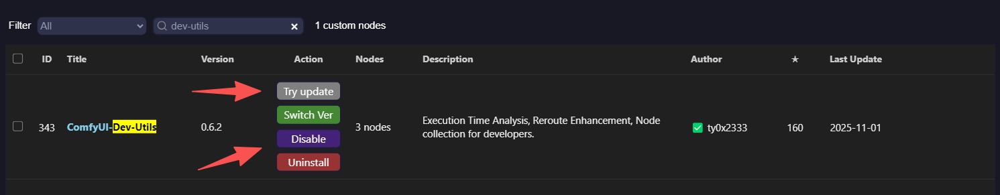

# ComfyUI 启动器

> 版本：v1.0.9

一个专为 ComfyUI 设计的图形化启动器，基于 PyQt5，提供便捷的启动选项管理、版本更新与 CLI 无界面模式。

## ⚠️ 重要提示：无法运行工作流的解决方案

> 如果启动 ComfyUI 后无法运行工作流，并在日志中看到类似错误：
>
> `dev_utils_execute() takes 10 positional arguments but 11 were given`
>
> 大概率是 **ComfyUI-Dev-Utils 插件版本不兼容** 导致的。
>
> ✅ 解决方法：**禁用或升级 ComfyUI-Dev-Utils 插件**。



## 功能特性

### 核心功能
- **多模式启动**: 支持多种启动配置（CPU、GPU、镜像源等）
- **版本信息**: 显示 ComfyUI、前端、模板库、Python、Torch 版本
- **批量更新**: 一键选择并更新内核/前端/模板库
- **配置管理**: 保存和管理启动参数配置
- **路径配置**: 支持自定义 ComfyUI 根目录与 Python 解释器路径
- **CLI 模式**: 无 GUI 后台启动/停止/状态查询，适合服务器与自动化场景

### 版本与更新
- 获取并展示版本信息
- 选择更新项目并执行批量更新
- 支持快速刷新状态
- 升级策略：可选择仅更新到稳定版（依据 GitHub Releases 标签）
- 依赖一致性：可选"模板库与前端版本遵循内核需求"，按 ComfyUI `requirements*.txt` 指定版本进行更新
- GitHub 代理：在内核版本管理中支持 gh-proxy 或自定义代理地址以加速拉取与标签刷新
- **启动器自身更新**（v1.0.8）：检测启动器新版本并引导升级

### 公告系统（v1.0.4）
- 启动时支持远程公告弹窗（JSON/纯文本），默认从内置地址拉取，配置缺失也可用。
- 支持 `index.json` 清单聚合：同时展示多条公告，统一弹窗滚动显示，条目间使用分割线。
- 版本匹配支持数学表达式：`version` 字段可用 `> >= < <= == *`，支持多条件 AND，例如 `">=v1.0.3 <1.2.0"`。
- 两个操作按钮：`知道了`（标记当前公告已读）、`不再弹出`（屏蔽当前公告），持久化到 `launcher/announcement_seen.json` 与 `launcher/announcement_muted.json`。
- 弹窗居中显示、支持长内容滚动；"关于启动器"页新增"查看公告"入口，读取 `launcher/announcement_cache.txt`。
- URL-only 条目支持：清单项仅提供 `url` 即可拉取并展示内容。

### 路径配置（v1.0.5）
- **自定义路径**: 在主界面直接查看和修改 ComfyUI 根目录及 Python 解释器路径。
- **灵活切换**: 支持为 ComfyUI 指定独立的 Python 环境，方便切换不同版本的 Python 或虚拟环境。
- **自动适配**: 修改路径后，启动器会自动刷新版本信息并使用新环境启动 ComfyUI，无需重启启动器。

### CLI 模式（v1.0.8）
- `--start`：无 GUI 启动 ComfyUI，后台运行，适合服务器/静默启动
- `--stop`：优雅停止 ComfyUI 进程
- `--status`：检查 ComfyUI 运行状态
- 详见 [CLI_README.md](CLI_README.md)

## 使用说明

### 启动启动器
```bash
# GUI 模式
python comfyui_launcher_pyqt.py

# 或通过 __main__.py（支持 CLI 参数）
python __main__.py              # 启动 GUI
python __main__.py --start      # 无 GUI 后台启动
python __main__.py --stop       # 停止
python __main__.py --status     # 查看状态

# 或直接运行已打包的可执行文件（若已构建）
# 双击 ComfyUI启动器.exe
```

### 使用流程
- 启动后，启动器会自动读取 `launcher/config.json`：
  - `paths.comfyui_root`：作为 ComfyUI 根目录；若未配置或无效，会弹窗提示选择 ComfyUI 根目录（包含 `main.py` 或 `.git`）。选择后会保存到配置文件。
  - `paths.python_path`：作为 Python 可执行路径；若未配置或无效，会按常见候选自动解析（如 `python_embeded/python.exe`）。
- **路径配置**：在"启动控制"下方，可点击"重设"按钮来更改 ComfyUI 根目录或 Python 路径。更改后立即生效。
- 在"启动与更新"页配置启动选项（CPU/GPU、端口、CORS、镜像与代理等）。
- 点击"一键启动"，启动器会按配置构造命令并启动 ComfyUI。
- 启动后约 1 秒，若存在可用公告将弹出聚合滚动弹窗。
- 若设置了镜像或代理，会注入相关环境变量（如 `HF_ENDPOINT`、`GITHUB_ENDPOINT`）。
- 检测到便携版 Git（优先在当前目录或打包目录的 `tools/PortableGit/bin/git.exe`）时，会在启动时注入 `GIT_PYTHON_GIT_EXECUTABLE` 并前置其 `bin` 到 `PATH`，无需手动设置系统环境；若未检测到，则回退到系统 Git。
- 若目标端口已被占用，启动器会提示是否直接打开网页而不启动新的实例；默认取消启动。
- 点击"停止"，会直接终止占用当前设置端口（默认 `8188`）的所有相关进程。
- 关闭窗口时，自动执行与"停止"一致的逻辑后退出。

### 快速操作
- 一键启动 ComfyUI
- 打开根/日志/输入/输出/插件目录
- 切换计算模式与网络选项

## 外置模型库管理

- 在"外置模型库管理"页选择外置模型库根路径，扫描并映射子文件夹
- 生成或刷新 `ComfyUI/extra_model_paths.yaml`，自动写入 `base_path` 与各子目录映射，变更前自动备份旧版本
- 映射列表与数量将实时展示，方便核对与维护

### 启动选项
- 计算模式：CPU / GPU
- 选项：快速模式、启用 CORS、监听 `0.0.0.0`
- 端口与额外参数：自定义端口与额外启动参数
- 注意力优化：支持 Split/Quad/PyTorch2.0/Sage/FlashAttention 等选项
- 启动后自动打开：默认浏览器 / 不自动打开 / 自定义浏览器

### 调试模式与日志
- 默认情况下，命令输出日志被严格收敛：每次命令的 `stdout`/`stderr` 最多记录少量行（默认 10 行），`netstat -ano` 仅记录行数摘要，避免日志膨胀。
- 开启调试模式：在 `launcher` 目录创建一个文件 `is_debug`（内容随意，如 `debug`）。存在该文件时，日志级别提升为 `DEBUG`，命令输出将更详细（按字符截断，默认 4000 字）。
- 关闭调试模式：删除 `launcher/is_debug` 文件即可恢复到普通模式。
- 可选高级调节：
  - 非调试模式下的每次输出行数上限可通过环境变量 `COMFYUI_LAUNCHER_LOG_LINES_LIMIT` 设置，例如：`5`。
  - 调试模式下的字符截断长度可通过 `COMFYUI_LAUNCHER_LOG_OUTPUT_LIMIT` 设置，例如：`2000`。
  - 配置文件 `launcher/config.json` 中的 `advanced.show_debug_info` 为 `true` 时，会自动创建 `launcher/is_debug` 文件以便开启调试模式（不会自动删除你手动创建的标记文件）。

## 项目结构

```
ComfyUI-Mie-Package-Launcher/
├── __main__.py                 # PyInstaller 入口（CLI 参数解析 → GUI/CLI 分发）
├── comfyui_launcher_pyqt.py    # GUI 入口（QApplication + 单实例锁 + 启动画面）
├── headless_app.py             # 无 GUI 应用上下文（CLI 模式使用）
├── config/
│   └── manager.py              # 配置管理器（读写 config.json）
├── core/                       # 核心能力层
│   ├── process_manager.py      # 进程生命周期管理
│   ├── process_events.py       # 进程事件（跨线程 UI 通知）
│   ├── app_state.py            # 应用状态机
│   ├── runner_start.py         # 启动逻辑
│   ├── runner_stop.py          # 停止逻辑
│   ├── runner.py               # 运行器入口
│   ├── probe.py                # 端口 / HTTP 可达性探测
│   ├── kill.py                 # 进程终止
│   ├── launcher_cmd.py         # 启动参数构建
│   ├── version_service.py      # 底层版本信息刷新
│   ├── version_manager.py      # 版本管理器（UI 代理）
│   ├── version_workers.py      # 版本操作工作线程
│   └── cli_start.py            # CLI 启动逻辑
├── services/                   # 业务服务层（依赖注入）
│   ├── di.py                   # ServiceContainer（统一服务注册）
│   ├── interfaces.py           # Protocol 接口定义
│   ├── process_service.py      # 进程服务
│   ├── version_service.py      # 版本服务（业务编排）
│   ├── update_service.py       # 内核/前端/模板库更新
│   ├── launcher_update_service.py  # 启动器自身更新
│   ├── config_service.py       # 配置服务
│   ├── git_service.py          # Git 解析与配置
│   ├── network_service.py      # PyPI 代理写入
│   ├── runtime_service.py      # 启动前运行时准备
│   ├── startup_service.py      # 预启动流程
│   ├── announcement_service.py # 公告系统
│   └── model_path_service.py   # 外置模型库管理
├── ui_qt/                      # PyQt5 界面层
│   ├── qt_app.py               # 主窗口（PyQtLauncher）
│   ├── theme_manager.py        # 主题管理
│   ├── theme_styles.py         # 主题样式定义
│   ├── components/             # 通用组件（导航栏、侧边栏）
│   ├── pages/                  # 页面
│   │   ├── launch_page.py      # 启动页（主页面，组合子模块）
│   │   ├── launch/             # 启动页子模块
│   │   │   ├── version_section.py
│   │   │   ├── launch_controls_section.py
│   │   │   └── environment_section.py
│   │   ├── version_page.py     # 版本管理页
│   │   ├── models_page.py      # 外置模型库页
│   │   ├── about_comfyui_page.py
│   │   ├── about_launcher_page.py
│   │   └── about_me_page.py
│   └── widgets/                # 可复用控件
│       ├── buttons.py / inputs.py / cards.py / tables.py
│       ├── announcement_dialog.py
│       ├── update_dialog.py
│       ├── progress_dialog.py
│       ├── custom_confirm_dialog.py
│       └── dialog_helper.py
├── utils/                      # 通用工具
│   ├── common.py               # 通用方法、单实例锁
│   ├── logging.py              # 日志配置
│   ├── paths.py                # 路径解析
│   ├── pip.py                  # pip 安装与查询
│   ├── net.py                  # 网络代理
│   └── ui_actions.py           # UI 辅助操作
├── tests/                      # 测试（pytest）
│   ├── conftest.py             # 公共 fixture
│   ├── unit/                   # 单元测试
│   ├── integration/            # 集成测试
│   ├── ui/                     # UI 测试（pytest-qt）
│   └── utils/                  # 测试工具（app_stub、mock_subprocess 等）
├── pyproject.toml              # 项目配置与 pytest 设置
├── build_exe.py                # PyInstaller 打包脚本
├── build_exe_v2.py             # Nuitka 打包脚本（推荐）
├── build_parameters.json       # 构建参数（版本号、构建时间）
└── README.md
```

## 架构与数据流

```
View (PyQt5)          Service (DI)           Core              External
┌──────────┐     ┌──────────────┐     ┌──────────────┐     ┌──────────┐
│ ui_qt/   │────>│ services/    │────>│ core/        │────>│ Git      │
│ pages/   │     │ di.py 注入   │     │ runner_start │     │ Python   │
│ widgets/ │<────│ 业务编排     │     │ runner_stop  │<────│ ComfyUI  │
│ qt_app.py│     │              │     │ probe        │     │ GitHub   │
└──────────┘     └──────────────┘     └──────────────┘     └──────────┘
      │                  │                    │
      │  UiInvoker       │  config/           │  utils/
      │  信号/槽          │  manager.py        │  paths/pip/net
      └──────────────────┴────────────────────┘
```

### 职责划分
- **View 层**（`ui_qt/`）：PyQt5 页面与控件，通过信号/槽响应用户操作，仅触发 Service 方法，不直接执行系统操作。跨线程 UI 更新通过 `UiInvoker` 信号机制安全调用。
- **Service 层**（`services/`）：通过 `ServiceContainer.from_app(app)` 依赖注入，执行业务流程（更新、代理、配置、运行时准备），调用 Core 与 Utils。
- **Core 层**（`core/`）：执行系统层面操作（子进程、端口探测、版本刷新、进程事件通知），通过回调与事件更新 UI 状态。
- **Config 层**（`config/`）：负责 `launcher/config.json` 的读写与原子更新。

### 关键调用关系
- **入口初始化**：`comfyui_launcher_pyqt.py` 创建 `QApplication` → `PyQtLauncher` → 内部调用 `ServiceContainer.from_app(app)` 注入全部服务。
- **启动流程**：`core/launcher_cmd.build_launch_params` 构造命令 → `core/runner_start.start` 启动 → `core/process_events.py` 发送进程事件 → UI 大按钮状态更新。
- **版本刷新**：`core/version_service.refresh_version_info` 异步查询版本，通过 `UiInvoker` 信号安全更新 UI。
- **CLI 模式**：`__main__.py` 解析参数 → `headless_app.HeadlessAppContext` 提供无 GUI 上下文 → `core/cli_start.cli_start` 启动 ComfyUI。

## 环境要求

- **操作系统**：Windows 10/11
- **Python**：3.8+（推荐 3.10/3.11）
- **依赖**：
  - `PyQt5>=5.15.0`
  - `PyYAML>=6.0`
- **可选依赖**：
  - `psutil`（端口与进程探测更健壮，`core/process_manager.py` 自动回退）
  - `requests`（便捷进行 API 示例调用）

## 打包 EXE

### 方式一：Nuitka 构建（推荐）
```bash
python build_exe_v2.py          # 正式版
python build_exe_v2.py --test   # 测试版
```

### 方式二：PyInstaller 构建
```bash
python build_exe.py
# 或
pyinstaller "ComfyUI启动器.spec"
```

### 构建产物
- `dist/ComfyUI启动器.exe` → 自动复制到项目根目录
- `build_parameters.json` 自动更新版本号与构建时间

### 说明
- Nuitka 构建产物体积更小、启动更快（`build_parameters.json` 中 `mode: nuitka_release`）。
- 若自定义图标，替换 `assets/rabbit.ico` 即可。
- 调试日志可通过在 `launcher` 目录下创建 `is_debug` 文件开启；打包后的 EXE 同样支持。
- 公告相关文件写入运行目录的 `launcher/` 子目录：`announcement_cache.txt` / `announcement_seen.json` / `announcement_muted.json`。

## 测试

测试框架使用 **pytest**，搭配 `pytest-qt` 进行 PyQt5 控件测试。

```bash
# 运行全部测试
pytest

# 仅运行单元测试
pytest tests/unit/

# 运行单个测试文件
pytest tests/unit/test_runner_start.py -v

# 带覆盖率报告
pytest --cov=. --cov-report=html
```

### 测试结构
- `tests/unit/` — 单元测试，覆盖 Service、Core、Utils 层
- `tests/integration/` — 集成测试，验证跨模块协作
- `tests/ui/` — PyQt5 UI 测试（需要 Qt 显示环境）
- `tests/utils/` — 测试工具（`app_stub`、`mock_subprocess`、`path_mocks`）

## 开发说明

### 模块开发规范
- 新增功能先定义 Service 接口（`services/interfaces.py` 中的 Protocol）并编写测试，再在 View 绑定事件。
- 避免在 View 层进行耗时或有副作用的操作（安装/更新/写文件），统一委派给 Service。
- Core 层对外通过稳定函数暴露能力，避免 UI 直接导入内部实现。
- 日志输出遵循现有精简策略（非调试模式仅记录摘要）。

### View 层约束
- 使用 PyQt5 信号/槽机制，跨线程 UI 更新必须通过 `UiInvoker` 信号。
- 事件处理只做参数收集与校验，将执行委派给 Service。

### Service 层约束
- 明确输入/输出契约，失败返回统一结构（`success/updated/up_to_date/version/error`）。
- 调用 Core 与 Utils，避免直接操作 UI 控件或线程调度。

## 文档
- CLI 使用说明：[CLI_README.md](CLI_README.md)
- 接口契约：[docs/ServiceInterfaces.md](docs/ServiceInterfaces.md)
- 自动更新设计：[docs/auto-update.md](docs/auto-update.md)
- 进程事件设计：[docs/process_events_design.md](docs/process_events_design.md)
- 启动页拆分说明：[docs/launch_page_decomposition.md](docs/launch_page_decomposition.md)
